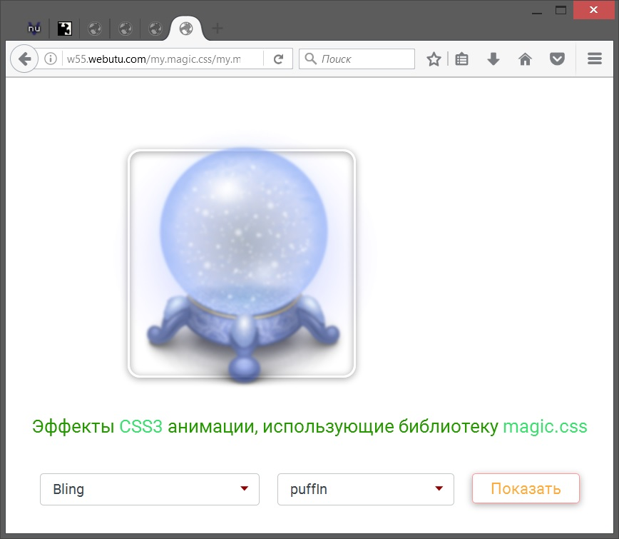

# my.magic
<a href="http://htmlbook.ru/css3">CSS3</a> animation example that uses <a href="https://github.com/miniMAC/magic">magic.css</a> library.

Take a look: <a href="http://w55.webutu.com/my.magic.css/my.magic.html">DEMO PAGE</a>.

This example uses HTML5, CSS3 and JQuery.
